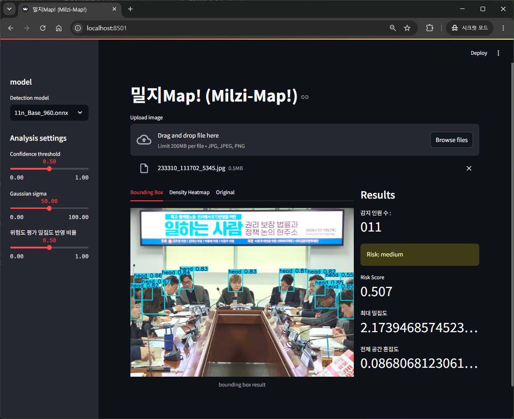
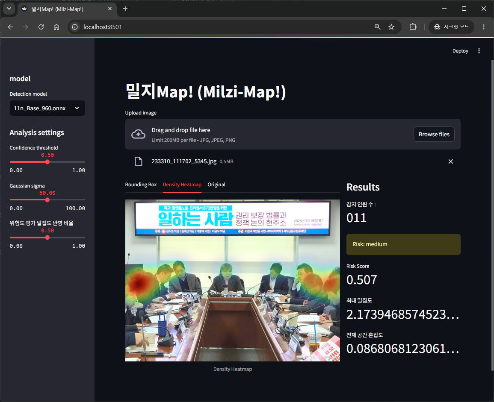
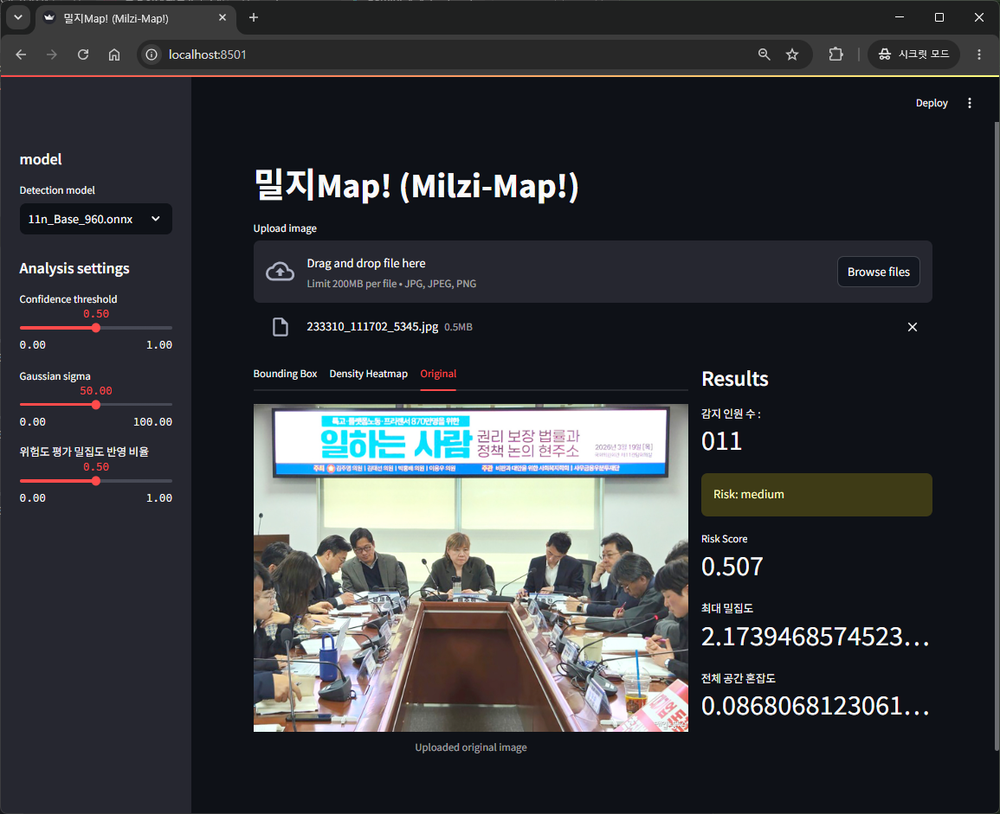
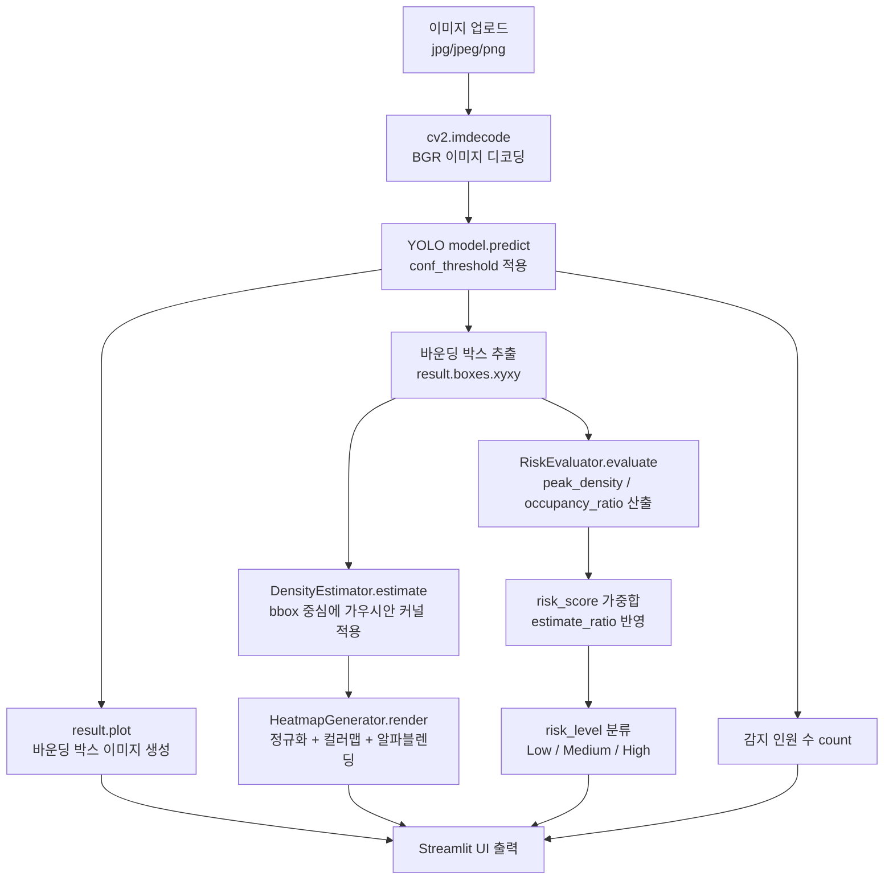

# 밀지Map! (Milzi-Map!)

YOLO 기반 객체 탐지 결과를 활용해 이미지 내 인원을 카운트하고, 가우시안 커널 기반 밀집도 히트맵과 위험도 점수를 산출하는 Streamlit 웹 애플리케이션.

## 1. 프로젝트 소개

### 주요 기능
- **인원 예측**: 업로드한 이미지에서 YOLO 모델로 head 탐지하고 바운딩 박스 표시
- **밀집도 히트맵**: 탐지된 바운딩 박스 중심에 가우시안 커널을 적용해 2D 밀집도 맵 생성 후 컬러맵으로 시각화
- **위험도 평가**: 최대 밀집도(Peak Density)와 공간 점유율(Occupancy Ratio)을 가중합하여 Low / Medium / High 3단계로 위험도 산출
- **모델 선택**: 사이드바에서 여러 YOLO 모델(.onnx / .pt) 중 선택해 실시간 교체 가능

### 실행 화면

| Bounding Box | Density Heatmap | Original |
|---|---|---|
|  |  |  |

## 2. 개발 환경 및 의존성

본 프로젝트는 **모델 학습 환경**과 **Streamlit 서빙 환경**이 분리되어 있습니다.
### Streamlit 서빙

| 항목 | 내용 |
|---|---|
| Python | `3.10.11` |
| OS | Windows 11 |
| GPU/CUDA | **CPU 사용 (GPU 미사용)** |
| CPU | 13th Gen Intel(R) Core(TM) i3-1315U 

### 모델 학습

| 항목 | 내용 |
|---|---|
| Python | `3.10.13` |
| PyTorch 내장 CUDA | `12.1` (PyTorch가 빌드 시 포함한 CUDA 런타임 버전) |
| GPU | NVIDIA GeForce RTX 4070 × 2 (각 12,282 MiB) |
| NVIDIA Driver / 시스템 CUDA | Driver `590.48.01` / CUDA `13.1` (드라이버가 지원하는 최대 CUDA 버전이며, 위 PyTorch 런타임 CUDA `12.1`과는 별개 항목) |

### 핵심 라이브러리 

| 패키지 | 버전 | 용도 |
|---|---|---|
| streamlit | 1.39.0 | 웹 UI (`app.py`) |
| ultralytics | 8.4.49 | YOLO 모델 로드 및 추론 (`processor.py`) |
| torch / torchvision / torchaudio | 2.2.1 / 0.17.1 / 2.2.1 | YOLO 추론 백엔드 |
| opencv-python | 4.9.0.80 | 이미지 디코딩, 가우시안 커널, 컬러맵, 알파블렌딩 (`density.py`, `heatmap.py`) |
| numpy | 1.26.4 | 배열/행렬 연산 전반 |
| pillow | 10.4.0 | 원본 이미지 표시 (`app.py`) |
| onnx / onnxruntime | 1.22.0 / 1.23.2 | `.onnx` 모델 추론 백엔드 |

전체 의존성 목록은 `requirements.txt`를 참고하세요.

## 3. 상세 설치 및 실행 방법

### 3.1 디렉토리 구조 

```
프로젝트_루트/
├── app.py
├── requirements.txt
├── model/                   
│   ├── onnxCode/               # onnx 변환 및 inference latency 측정에 사용된 코드(서빙과는 무관)
│   ├── 11n_Base_960.onnx       # 아래 3.3 참고
│   ├── 8m_Base_960.onnx
│   ├── ...
│   └── yolov8n.pt
└── utils/
    ├── config.py
    ├── processor.py
    ├── density.py
    ├── heatmap.py
    └── RiskEvaluator.py
```
- (참고) `model/onnxCode/`는 ONNX 변환 스크립트 보관용이며 서빙 시에는 사용되지 않습니다.

### 3.2 설치

```bash
# 저장소 클론
git clone https://github.com/Arom32/Milzi-Map.git
cd Milzi-Map

# 가상환경 생성 
python -m venv venv

# 가상환경 활성화
venv\Scripts\activate       # Windows (cmd)
venv\Scripts\activate.bat   # Windows (PowerShell,cmd)
source venv/Scripts/activate # Windows (bash)
source venv/bin/activate     # macOS / Linux

# 의존성 설치
pip install -r requirements.txt
```

### 3.3 모델 파일 준비

`utils/config.py`의 `AVAILABLE_MODELS`에 정의된 아래 모델 파일들을 `model/` 폴더에 위치시켜야 합니다. 

- `11n_Base_960.onnx`
- `8m_Base_960.onnx`
- `8n_Base_960.onnx`
- `11n_base_640.onnx`
- `11n_ConservativeT_960.onnx`
- `11n_HatPlus_960.onnx`
- `11n_PramOnly_960.onnx`
- `11n_Tuned_960.onnx`
- `26n_Base_960.onnx`
- `yolov8n.pt`


 모델은 아래의 경로에서 다운 받으실 수 있습니다. 

> https://drive.google.com/drive/folders/1w1jjeTujIvRu496ouuTfnTLoQxFWUPiD?usp=sharing

### 3.4 실행

```bash
streamlit run app.py
```

실행 후 브라우저에서:
1. 사이드바 `Detection model`에서 사용할 모델 선택
2. `Confidence threshold`, `Gaussian sigma`, `위험도 평가 밀집도 반영 비율` 슬라이더로 분석 파라미터 조정
3. 상단 `Density` 모드에서 이미지(jpg/jpeg/png) 업로드 → Bounding Box / Density Heatmap / Original 탭에서 결과 확인
4. 우측 패널에서 감지 인원 수, 위험도(Low/Medium/High), Risk Score, 최대 밀집도, 전체 공간 혼잡도 확인

## 4. 데이터 파이프라인




### 단계별 설명

1. **이미지 입력**: `st.file_uploader`로 업로드된 파일을 `processor.py`에서 byte 단위로 읽어 `cv2.imdecode`로 디코딩
2. **객체 탐지**: 선택된 YOLO 모델(`.onnx` 또는 `.pt`)로 `model.predict(img, conf=conf_threshold)` 실행, 바운딩 박스(`xyxy`) 추출
3. **밀집도 추정**: `DensityEstimator`가 각 바운딩 박스 중심에 박스 크기 비례 시그마를 가진 가우시안 커널을 누적하여 2D 밀집도 맵 생성
4. **히트맵 시각화**: `HeatmapGenerator`가 밀집도 맵을 0~255로 정규화 후 `COLORMAP_TURBO` 적용, 원본 이미지와 알파블렌딩(alpha=0.9)
5. **위험도 평가**: `RiskEvaluator`가 밀집도 맵의 최댓값(`peak_density`)과 임계값 이상 픽셀 비율(`occupancy_ratio`)을 각각 정규화한 뒤, `estimate_ratio` 가중치로 선형 결합하여 `risk_score` 산출 → 0.5 / 1.0 기준으로 Low / Medium / High 분류
6. **결과 출력**: 바운딩 박스 이미지, 히트맵 이미지, 원본 이미지, 인원 수, 위험도 정보를 Streamlit 탭/메트릭으로 표시

## 5. 팀원별 역할 분담

| 이름 | 역할 | 
|---|---|
| 김규린(20240727) | 프로젝트 구체화, 데이터 수집 및 처리, 모델 학습, 보고서 작성 및 최종 검토 |
| 이지현(20240789) | streamlit 로직 설계 및 코드 작성 , 모델 학습, 보고서 작성  |